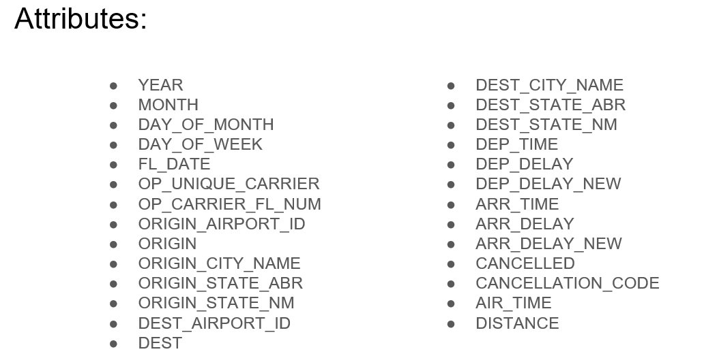
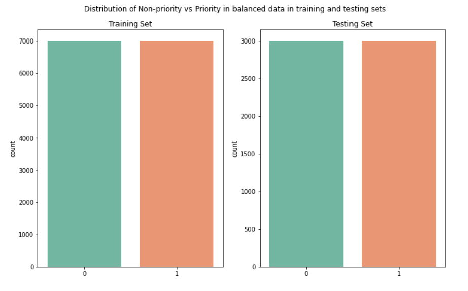
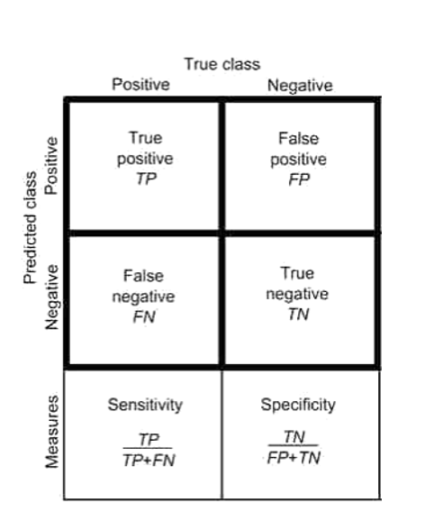
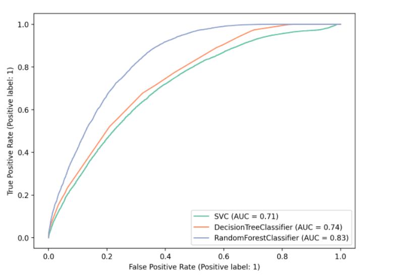
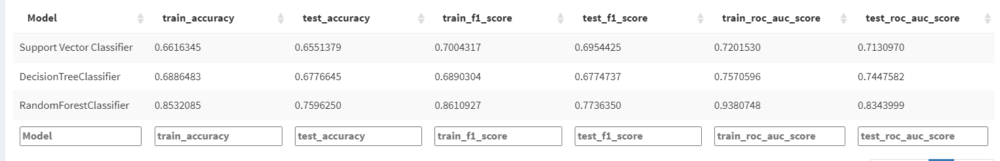

# PandemicFlightAnalysis

## Problem Statement
The goal of the project is to identify the most impactful flight routes during the pandemic to suggest aviation authorities
to minimize the flights in such a way as to control the spread of Covid-19 yet keep making sufficient profit.
Our proposed solution is to decrease the number of flights to a minimum per state utilising only those airports 
with most recurring and frequent flights so that travelers can reach their desired destinations, while lowering the spread of Covid-19.  

So we ask ourselves the question, is it possible to predict the most important flight routes during a pandemic?
By analyzing the most important airports and flights, we try to create a model that can classify an airport base on their 
flights to minimize the pandemic spread and maximize the profits of airlines while limiting the number of flights across the United States.  

## Steps Overview:
- Collect the data and split the data into training and testing datasets.
- Train with the classifier models such as SVM, Decision Tree, Random Forest using the training set. (Considered cross validation for hyper-parameter tuning)
- Evaluate the testing set using the trained classifier models.
- Plot ROC to measure the performance of the model. Measure other performance metrics such as sensitivity, specificity, true positive rate etc.,.

## Data 

We have collected the data from Bureau of transportation mainly for years 2020, 2021.  
Below are the attributes:  

  

## Preprocessing
- Checked for missing values and removed the rows where there is a NA value(around 2%).
- Identified the top 3 airports in each state based on number of flights that travel from that airport in the year. 
airport_label with value of 1 indicating the popularity of the airport.
- From these most popular airports, we identified the flights to top 3 destinations.
flight_label with a value of 1 indicating the popularity of the flight.

In 2020, there are 142 airports and there are 224 distinct flights from these airports considered as important.
In 2021, there are 143 airports and there are 214 distinct flights from these airports considered as important.

**Sub sampling:** Our data has a huge imbalance of important and non-important flights (36622 vs 458142). So, we selected a smaller subset of the original data. We understood how the subset is specified by choosing a parameter n, specifying the size of the subset.  

  

**Cross-validation,** was used to divide our dataset into random groups, holding one group out as the test, while training the model on the remaining groups. We learned that this process is repeated for each group being held as the test group, then the average of the models are used for the resulting model.

## Metrics
**ROC (Receiver Operating Characteristic) curve** is a graph that measures the performance of a classification model at all various thresholds. 

**This curve plots three things:**
1. True Positive Rate (TPR)
2. False Positive Rate (FPR)
3. Thresholds (implicitly)

The ROC curve is plotted with TPR on the 
y-axis and FPR on the x-axis.
TPR = Sensitivity 
FPR = 1- Specificity

We cannot have the all the values of sensitivity and specificity unless we have an infinite test set. Hence the curve may not be smooth.

A **confusion matrix** visualizes and summarizes the performance of a classification algorithm.

It is useful for calculation of metrics such as sensitivity, specificity, precision, recall, accuracy etc.

1) True Positives(TP): Model predicts Yes when the original label was Yes.
2) False Positives(FP): Model predicts Yes when the original label was No.
3) False Negatives(FN): Model predicts No when the original label was Yes.
4) True Negatives(TN): Model predicts No when the original label was No.

   

**AUC(Area Under the Curve)**  
Provides an aggregate measure of performance across all possible classification thresholds. 
It tells how much the model is capable of distinguishing between classes and shows the probability that the model ranks a random positive example more highly than a random negative example.
The value of AUC is between 0 to 1. Higher the value, better the performance of the model.
**Scale-invariant:** It measures how well predictions are ranked, rather than their absolute values. This could lead to a problem where we need a well calibrated probability.
**Classification-threshold-invariant:** It measures the quality of the model's predictions irrespective of what classification threshold is chosen. So, in a condition where you want to minimize the False Positive Rate (spam detection), the AUC can not be a good metric for this situation.

## Results  

We considered below machine learning methods and plotted the AUC curve and also measured the accuracy, f1-score, auc scores.  

1. Decision Tree Classifier
2. Random Forest Classifier
3. Support Vector Machine Classifier

**Hyper-parameters Tuning**  
Tree based methods, for which we split the sample into two or more sets based on most significant splitter from the input features. We saw how each successive split adds some complexity to the model, which can be used to make better predictions in many cases.  

1. Decision Tree
- We use grid search method to find the best max_depth parameter.
- The higher the max_depth the higher the accuracy, however, it can lead to overfit.

2. Random Forest Tree
- We use grid search method to find the best max_samples parameter.
- Max_samples indicates the number of samples to draw from X to train each base estimator.

3. Support Vector Machine
- We use grid search method to find the best C parameter.
- This provides the balance between achieving a low training error and allowing for misclassifications.

  

  

   

  
   

  
   

  
   

From the above results we can see that the Random Forest Classifier model performs better compared to other models.  

## Challenges:
Lack of some of features such as:
- Missing prices of flights to verify the results.
- No information regarding number of passengers onboard.
- The impact of Covid around the time of each flight was not monitored.

## Conclusion:
- We have extracted the data from bureau of transportation for years 2020, 2021.
- The importance of the route or the flights have been decided on the basis of the frequency of flights between the origin and destination. So, created a target label priority_label based on that.
- Performed data prepocessing and applied machine learning classification algorithms considering the techniques like cross validation, hyper parameter tuning.
- Noticed that the Random Forest Models are better for the given data.

